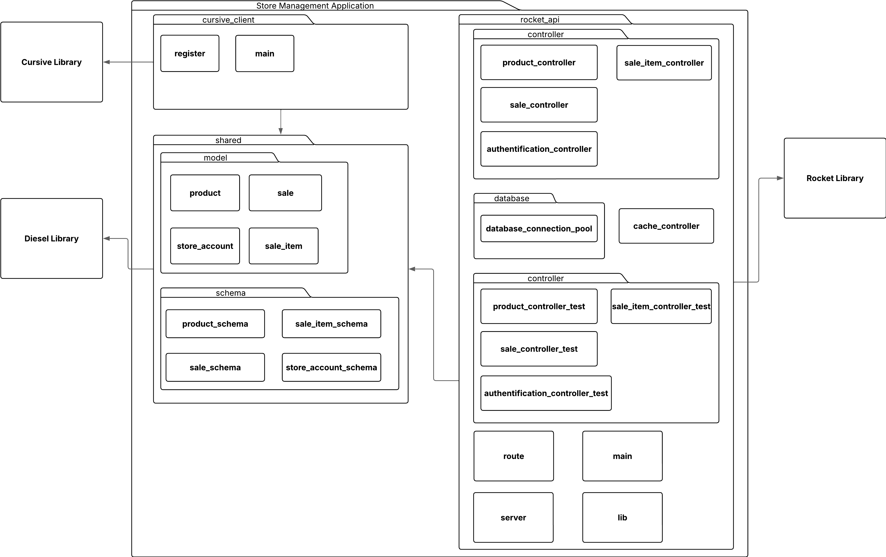
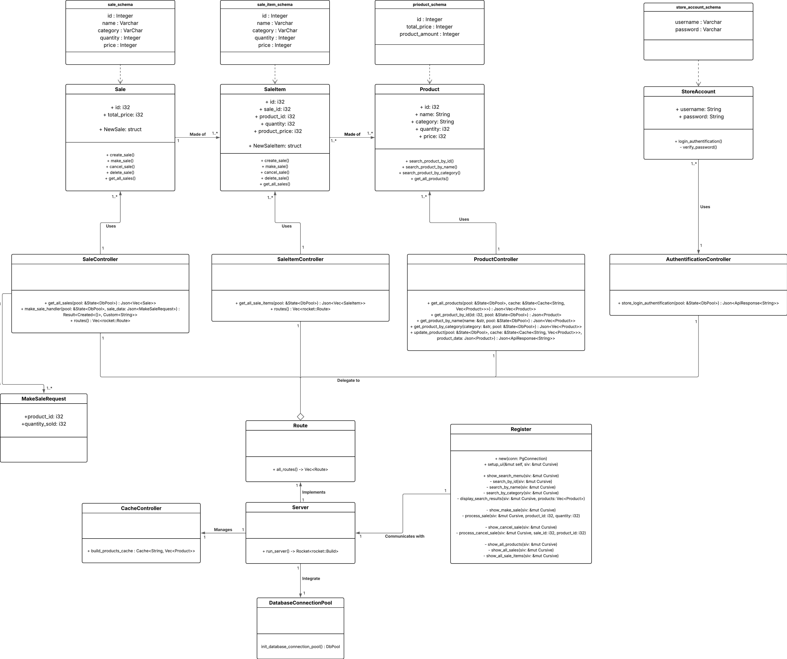
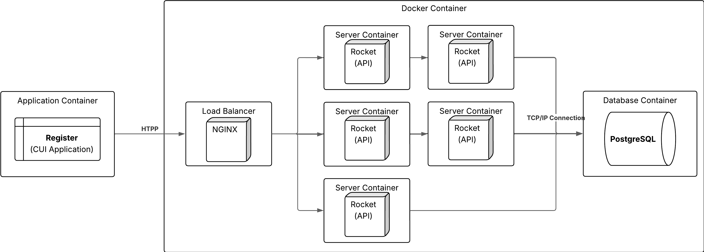
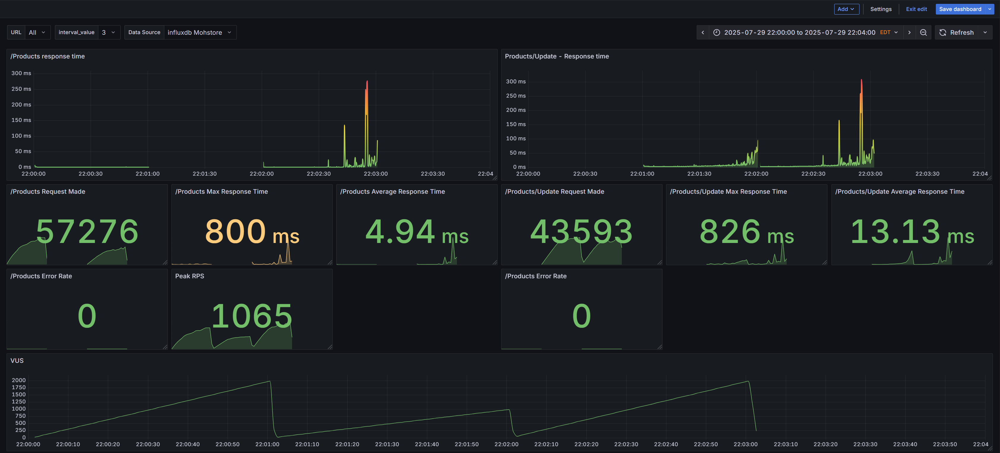
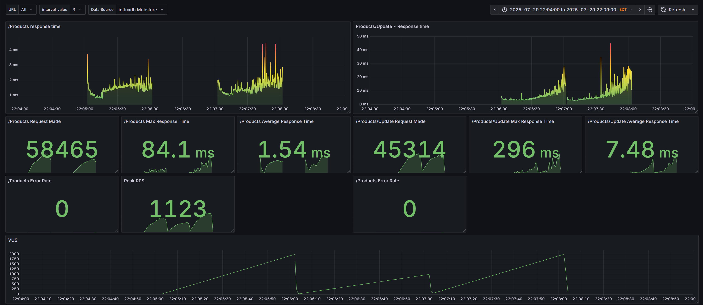
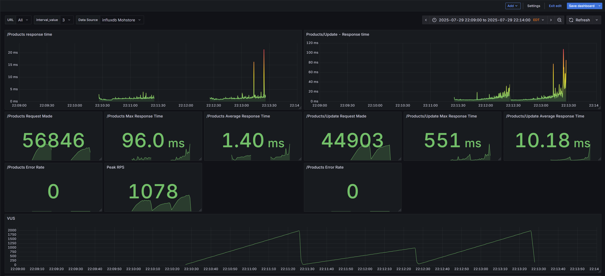

## Rapport rédigé par Benkhalfa Mohamed-Amine

Lien du projet github: https://github.com/MohETS/Store-Management-System/tree/labo2

Introduction and Objectif
======================

L'objectif de l'étape 2 est de convertir notre application monolithique vers une application en microservices. Cette évolution se fera à travers 3
laboratoires qui introduiront des changements graduellement, afin de voir les impacts de chacun des changements sur les performances de notre
application et d’observer les changements sur notre architecture.

Requirements Overview
---------------------

Dans le cadre du laboratoire, nous devons créer une application pour un magasin qui contient plusieurs succursale. Durant ce laboratoire, nous devrons
intégrer de la sécurité pour les endpoints de nos API, rajouter du caching et du load balancing. Finalement, il faudra diviser nos services en
microservice et intégrer une API Gateway.

Quality Goals
-------------

Pour cette itération des laboratoires, notre but est d’observer des améliorations au niveau des performances de nos requêtes via l’API. Avec
l’implémentation de caching, load balancing, API gateway, nous voulons voir une amélioration dans le temps de réponses pour des requêtes et la
quantité d’utilisateurs simultanés que nous pouvons supporter.

Stakeholders
------------

Puisque ce laboratoire est individuel, je suis le seul stakeholder au niveau du code et de l’architecture. Cependant, l’enseignant et les chargés de
laboratoires sont aussi des stakeholders parce qu'ils doivent être capable de comprendre le code, le naviguer et être capable de le déployer pour
l’essayer. Il est donc important que le code soit clair et qu’il y ait suffisamment d’instruction pour qu’ils puissent déployer l’application sans
l’aide du développeur.

Architecture Constraints
========================

Puisque cette application est réalisée dans le cadre d’un laboratoire, il est important que la réalisation du travail reste simple. Il faut donc
éviter d’utiliser des librairies ou des outils qui nécessiteraient trop de dépendances pour réaliser l’application. Puisque le projet est réalisé en
Rust, il est important d’essayer d’utiliser le plus d’outils qui pourraient être directement intégrés avec un « crate » plutôt qu’une dépendance
externe. L’objectif est de nous simplifier le déploiement de l’application et d’éviter d’avoir besoin d’installer des dépendances externes sans
utiliser « cargo ».

System Scope and Context
========================

Pour le laboratoire, nous devions créer un système de gestion de magasin qui évoluerait dans le temps avec différentes fonctionnalités comme faire des
ventes, chercher des produits, générer des rapports, etc. Par manque de temps et pour réduire la complexité de l’application, nous avons omis
plusieurs cas d’utilisation afin de garder la réalisation des laboratoires simple. Le système n’implémente donc pas des opérations selon différents
magasins, mais plutôt des actions qui sont globales pour tous les magasins. Pour plus de détails sur les fonctionnalités de l’application, se fier au
diagramme de cas d’utilisation.

Technical Context
-----------------

**Test**

Pour l’intégration des tests, nous avons d’abord créé une base de données qui est uniquement utilisée pour réaliser des tests afin d’éviter d’impacter
les données de la vraie base de données, mais de tester les communications avec la base de données. Les tests qui ont été réalisés sont des tests
d’intégrations pour tester les différentes routes et leur fonctionnalité. Nous avons aussi rajouté une couverture de code lorsque l’on effectue nos
tests pour assurer que la majorité du code est testé. L’outil utilisé est « cargo-tarpaulin » pour la couverture de test.

**Documentation API**

Pour la documentation des différentes endpoints de l’API, nous avons utilisé l’outil Swagger avec la libraire « rocket_okapi » afin de générer
automatiquement la documentation, en utilisant les routes qui ont été créer. Cela facilite énormément la documentation des routes, car Swagger se
charge automatiquement de créer l’information en lien avec l'endpoint et s’occupe aussi de rajouter l’option de tester les endpoints directement sur
la documentation. On peut donc automatiquement se renseigner sur les endpoints et faire des tests sur ces endpoints au même endroit.

**Test de charge**

Pour les tests de charge, nous les avons effectués avec l’outil K6 qui est un outil faisant partie de l’écosystème de Grafana. Puisque nous avions des
cas d’utilisation simple pour faciliter le développement de l’application, nous avons utilisé les trois scénarios suivants pour effectuer nos tests de
charge. Le premier scénario consiste à faire la demande de la liste de tous les produits. Nous avons un nombre d’utilisateurs simultanés qui augmente
graduellement jusqu’à ce qu’il atteigne les 2000 utilisateurs simultanés. Le deuxième scénario est similaire au précédent, seulement, cette fois-ci
les utilisateurs mettent à jour un produit aléatoire et que le nombre d’utilisateurs visé est 1000. Finalement, le dernier scénario combine les deux
précédents afin d’avoir un scénario ou des utilisateurs demandent la liste de produit pendant que d’autres modifient les produits. L’objectif avec le
dernier scénario est de voir l’impact sur la cache et la disponibilité des ressources lorsque plusieurs utilisateurs simultanés modifient les mêmes
ressources.

**Load Balancer**

Pour rajouter du « load balancing » à notre projet, nous avons décidé d’implémenter Nginx dans la plus simple des façons. Nous créer un fichier de
configuration pour Nginx et avons modifié le docker-compose pour utiliser la fonction « --scale server=5 » afin de déployer 5 instances de notre
serveur, lors du déploiement de notre application.
Caching
Puisque dans nos tests de charge, il n’y a que le scénario de recherche de produit qui peut bénéficier de l’avantage d’avoir de la cache, nous l’avons
implémenté uniquement pour la route qui retourne la liste de tous les produits. Pour l’application nous ne faisons que du caching local au niveau des
instances serveur, ce qui signifie que chaque instance aura sa propre cache. Plus de détails sur ces choix sont disponibles dans le ADR concernant le
caching.

**Découpage en Service**

Cette partie du laboratoire n’a pas pu être implémentée par manque de temps et à cause de la quantité de refactoring que cela aurait demandé.
Cependant, voilà ce qui aurait été fait si nous avions implémenté cette section. Nous aurions d’abord divisé notre API pour avoir les 3 services
suivante. Nous aurions eu un service d’authentification qui consisterait principalement du code de notre contrôleur « authentification_controller ».
Notre deuxième service concernerait notre système de vente qui serait une combinaison de notre code avec « sale_controller » et «
sale_item_controller ». Finalement, le dernier service que nous aurions créé est un service pour la gestion des produits. Celui-ci serait constitué du
code de « product_controller ». Cela nous aurait permis d’avoir nos 3 services distincts et nous aurions pu ajouter Kong comme API Gateway pour faire
la gestion de nos différents services.

Building Block View
===================

**Diagramme de paquetage**

**Diagramme de classe**

Runtime View
============

Diagram de sequence

Deployment View
===============
**Diagramme de déploiement**

Design Decisions
================

## Utilisation d’Influx DB pour la gestion des données des tests de charge

### Statut

Approved

### Contexte

Dans le cadre de la réalisation de nos tests de charge avec l’outil K6, il nous fallait une source pour entreposer les données que nous aurons
récoltées pour nos différents tests. L’objectif est d’utiliser cette source de données avec Grafana afin de faire des graphiques qui établiront des
métriques pour les tests que nous avons effectués.

### Décision

Au début la décision était d’utiliser Prometheus pour gérer les données, car nous voulions aussi avoir des informations sur le hardware lors de nos
tests de charge. Cependant, puisque nous avons utilisé K6 pour la réalisation des tests de charge, nous avons fait face à des problèmes de
configuration avec Prometheus et K6. K6 ne possède pas encore une version stable pour l'intégration de Prometheus, ce qui fait que la configuration
n’était pas simple et lorsqu’elle a fonctionné, celle-ci n’avait pas toutes les données de nos tests. Pour éviter de perdre plus de temps sur la
configuration de Prometheus, nous avons décidé d’utiliser InfluxDB pour gérer les données retournées par les tests.

### Conséquence

L’avantage avec InfluxDB, c’est que la configuration est très simple et elle marche facilement avec Grafana, qui la reconnait directement comme une
source. Cependant, le désavantage avec InfluxDB, c’est qu’elle ne nous offre pas beaucoup de fonctionnalité comme Prometheus. Elle agit simplement
comme une base de données. Nous avons donc dû laisser tomber les statistiques concernant l’utilisation du hardware durant nos tests puisque nous
n’avons pas utilisé Prometheus.

## Utilisation d’une cache locale avec Moka

### Statut

Approved

### Contexte

Pour le laboratoire, nous avons comme responsabilité d’implémenter un système de cache pour notre serveur. L’objectif est d’essayer d’améliorer les
performances de nos requêtes avec l’utilisation de la cache.

### Décision

Nous avons décidé d’utiliser un système de cache local avec la librairie Moka, pour gérer l’obtention de notre liste de produit. Nous aurions pu
utiliser Redis pour la gestion de la cache, mais afin de garder l’implémentation de la cache simple pour le laboratoire, nous avons pris l’approche
locale.

### Conséquence

Le désavantage avec cette approche, c’est que la cache est locale alors que nous avons implémenté du load balancing. Par exemple, dans notre
déploiement avec nos 5 instances de notre serveur, chaque instance a sa propre gestion de la cache. Ce qui fait que même si une des instances à
l’information souhaitée en cache, si la prochaine requête est envoyée à une autre instance, il y aura un cache miss. On perd donc l’avantage d’avoir
un système de cache comme Redis, qui rendrait la cache disponible pour toutes nos instances.

Load Test Grafana
===============
**Graphique load test basique**

**Graphique load test avec load balancer**

**Graphique load test avec caching**

Risks and Technical Debts
=========================

Dans la réalisation du projet, il y a plusieurs dettes techniques qui se sont accumulées, spécialement autour des cas d’utilisation qui n’ont pas été
implémentés. L’absence de certains cas d’utilisation fait que l’architecture a été conçue d’une certaine façon afin de simplifier l’implémentation des
requis du laboratoire. Par exemple, il n’y a pas d’implémentation « multi-magasin » pour les différents cas d’utilisations, donc l’ajout de ces
fonctionnalités plus tard nécessiterait beaucoup de refactoring, car les différentes routes que nous avons implémentées devront maintenant vérifier
qui effectué la requête et s’ils ont les droits nécessaires pour réaliser ces fonctions. Il y a aussi l’utilisation d’outils de développement comme K6
pour la création des tests de charge qui n’a pas une implémentation stable de Prometheus, ce qui fait qu’il n’y a pas d’implémentation pour avoir des
valeurs sur l’utilisation du « hardware » durant nos tests. L’ajout de cette fonctionnalité entrainerait donc un changement d’outils de charge de test
pour les prendre en comptes.