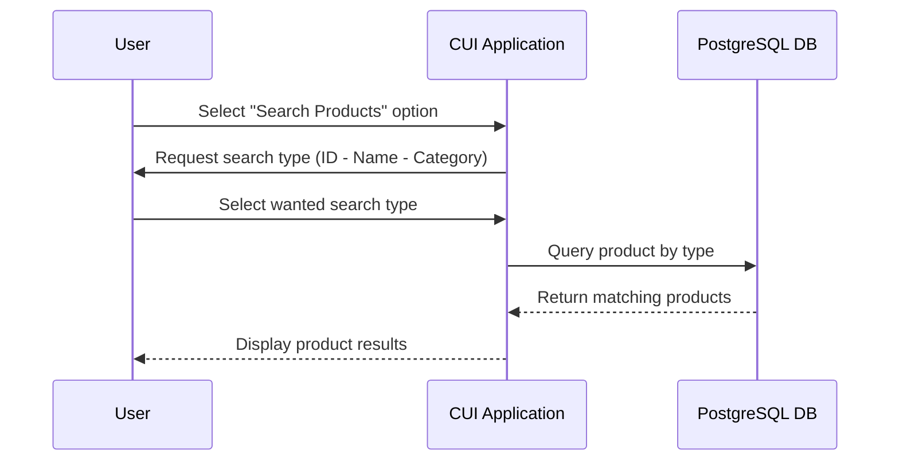
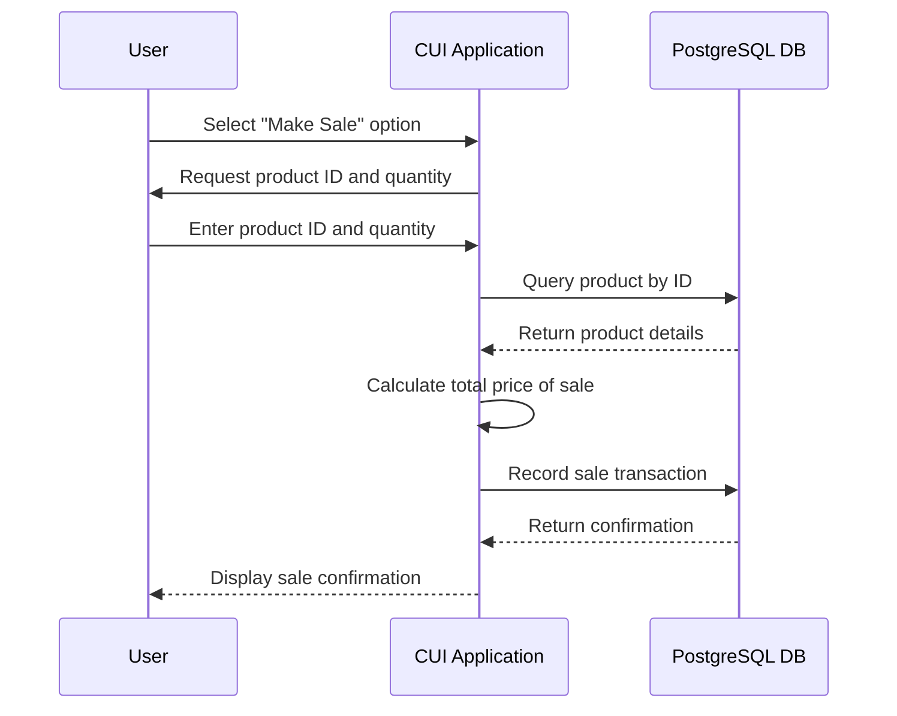
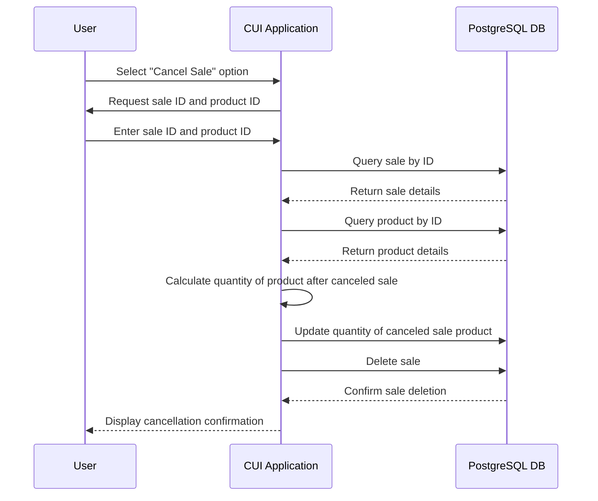
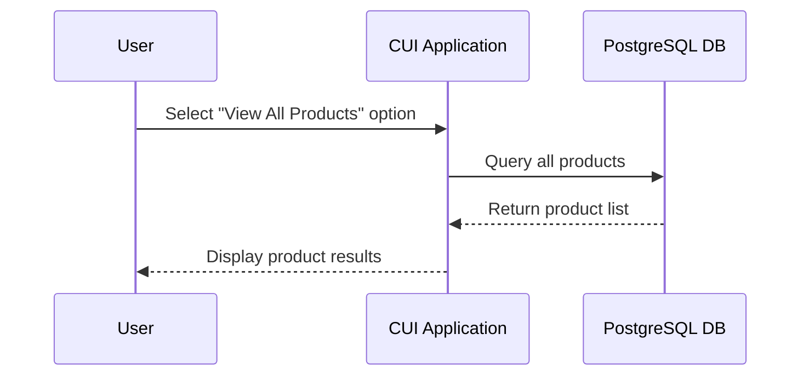

# Sequence diagrams

### (UC-01) Search products by ID, Name or Category

```mermaid
sequenceDiagram
    participant User
    participant ConsoleUI as CUI Application
    participant Database as PostgreSQL DB

    User->>ConsoleUI: Select "Search Products" option
    ConsoleUI->>User: Request search type (ID - Name - Category)
    User->>ConsoleUI: Select wanted search type
    ConsoleUI->>Database: Query product by type
    Database-->>ConsoleUI: Return matching products
    ConsoleUI-->>User: Display product results
```

### (UC-02) Make a sale

```mermaid
sequenceDiagram
    participant User
    participant ConsoleUI as CUI Application
    participant Database as PostgreSQL DB

    User->>ConsoleUI: Select "Make Sale" option
    ConsoleUI->>User: Request product ID and quantity
    User->>ConsoleUI: Enter product ID and quantity
    ConsoleUI->>Database: Query product by ID
    Database-->>ConsoleUI: Return product details
    ConsoleUI->>ConsoleUI: Calculate total price of sale
    ConsoleUI->>Database: Record sale transaction
    Database-->>ConsoleUI: Return confirmation
    ConsoleUI-->>User: Display sale confirmation
```

### (UC-03) Cancel sale

```mermaid
sequenceDiagram
    participant User
    participant ConsoleUI as CUI Application
    participant Database as PostgreSQL DB

    User->>ConsoleUI: Select "Cancel Sale" option
    ConsoleUI->>User: Request sale ID and product ID
    User->>ConsoleUI: Enter sale ID and product ID
    ConsoleUI->>Database: Query sale by ID
    Database-->>ConsoleUI: Return sale details
    ConsoleUI->>Database: Query product by ID
    Database-->>ConsoleUI: Return product details
	ConsoleUI->>ConsoleUI: Calculate quantity of product after canceled sale
    ConsoleUI->>Database: Update quantity of canceled sale product
    ConsoleUI->>Database: Delete sale
    Database-->>ConsoleUI: Confirm sale deletion 
    ConsoleUI-->>User: Display cancellation confirmation
```

### (UC-04) View all products

```mermaid
sequenceDiagram
    participant User
    participant ConsoleUI as CUI Application
    participant Database as PostgreSQL DB

    User->>ConsoleUI: Select "View All Products" option
    ConsoleUI->>Database: Query all products
    Database-->>ConsoleUI: Return product list
    ConsoleUI-->>User: Display product results
```